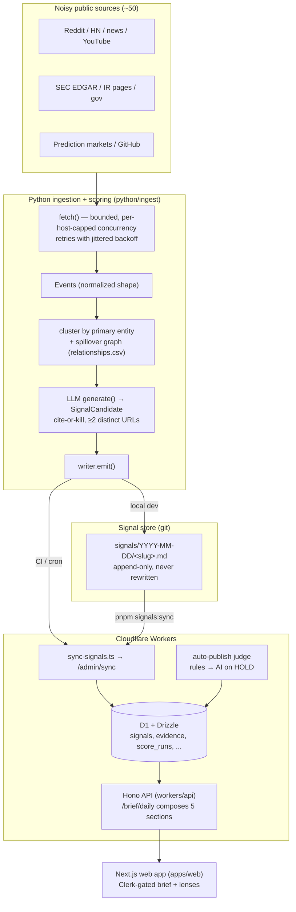

# How High Signal works, end to end

> **Start here** if you are learning the system. This page traces one signal from
> a noisy public source all the way to a published brief, names the major
> components and their boundaries, and explains the key design decisions and
> *why* they were made. It links out to the canonical detail pages rather than
> restating them — read [`codebase-structure.md`](codebase-structure.md) for the
> file-ownership map, [`decisions.md`](decisions.md) for the ADRs behind every
> "why", [`data-service-boundary.md`](data-service-boundary.md) for the
> ingestion/insight split, and [`../operations/jobs.md`](../operations/jobs.md)
> for the exact cron schedule.

High Signal is **one product**: a daily synthesized brief that answers five
questions for the operator (see [`../product/direction.md`](../product/direction.md)).
Everything below exists to produce that brief with cited, scorable evidence.

## The one-sentence version

Every day a Python pipeline pulls ~50 public sources, clusters what changed by
entity, asks an LLM to write a cited signal, writes it as an append-only
markdown file, syncs it into D1, lets a two-tier judge publish or kill it, and
the Hono API composes the survivors into a Daily Brief the Next.js app renders.

## The daily data flow

Cron ordering (06:00 ingest → 07:00 publish → later scoring) is authoritative in
`.github/workflows/*.yml` and documented in [`../operations/jobs.md`](../operations/jobs.md).

## Stage by stage

### 1. Ingestion — noisy sources to normalized events

`python/ingest/src/high_signal_ingest/pipeline.py` is the orchestrator. `fetch()`
fans every selected source adapter across a thread pool (`FETCH_CONCURRENCY`,
default 8) while a per-host semaphore serialises adapters that hit the same
provider — SEC/EDGAR share one `sec.gov` gate so they never trip its rate limit
together. Each adapter call retries transient failures with exponential
full-jitter backoff; a single flaky source returns `[]` and is recorded in the
run audit rather than aborting the batch.

Every adapter under `sources/` flattens its source-specific response into one
shared `Event` shape (`source`, `source_url`, `published_at`, `title`,
`content`, `primary_entity_id`, `raw_hash`). That deliberate flattening is the
current ingestion layer; the durable plan is to push raw-payload preservation
into a data substrate so High Signal stays the *insight* layer, not the
warehouse — see [`data-service-boundary.md`](data-service-boundary.md).

### 2. Clustering, entity resolution, and spillover

Raw events are persisted for replay (`audit.push_events`), then exact duplicates
(same canonical URL re-reported across feeds) are collapsed with
`dedupe_exact` — but distinct-URL corroboration is preserved so a signal can
still show cross-source agreement.

Each event is attributed to a **primary entity**. Attribution runs a
gazetteer-first, GLiNER-fallback extractor (ADR-003): a hand-curated entity
gazetteer matches the known universe at near-zero cost; GLiNER zero-shot NER
catches novel mentions, which land in the `/unmapped` review surface rather than
publishing directly. Events are then grouped by entity and ranked by
independent-source and distinct-URL count.

The **spillover graph** (`graph.py`) loads a hand-curated `relationships.csv`
into a NetworkX directed multigraph and does a hop-decayed BFS (`spillover_ids`,
2 hops, weight × decay) to find suppliers/customers/peers up to two hops out.
This is the moat mechanic — an event on one entity implies 2nd-order impact on
connected ones (e.g. TSMC capex → ASML → cloud). Relationship *extraction*
(GLiREL) is deliberately stubbed to `[]` for v0 because accurate edges matter
more than broad coverage at this size (ADR-004); the graph grows by manual
curation.

### 3. Generation — cite or kill

`generator.generate()` sends a ranked entity cluster (plus its spillover
candidates) to an LLM and asks for a `SignalCandidate`: a 150–400-word evidence
walkthrough that cites each source by URL. To keep the daily ~40 clusters down
to ~5–10 LLM calls, small clusters that are connected in the spillover graph are
merged into one batched call (`generate_batch`); large clusters get their own
call for quality.

**Cite-or-kill is enforced at every layer**: source-strength requires ≥ 2
distinct URLs to reach `medium`/`high`, thematic (entity-less) drafts require
≥ 2 distinct sources *and* ≥ 2 URLs, and if the LLM is unavailable the pipeline
degrades to conservative `fallback_candidate` drafts (never silent failure).
The rationale (evidence-first, "cite or kill") comes from the founding thesis:
the public hit-rate ledger is the product's moat, so an uncited claim has no
value here.

### 4. The signal store — append-only git markdown

`writer.emit()` chooses its target by environment (ADR-002):

- **Local dev**: writes `signals/YYYY-MM-DD/<slug>.md` with YAML frontmatter
  (entities, direction, confidence band, evidence URLs + quotes, predicted
  window, quality score/band/reasons, `review_status`). This git tree is the
  **source of truth**.
- **CI / cron** (ephemeral container filesystem): POSTs the candidate straight
  to `{API_BASE}/admin/sync`.

**Why git markdown, not DB-only?** The artifact is the moat: every signal
logged, every prediction scored, no retroactive edits. Git diff *is* the audit
trail and the credibility claim. Corrections never overwrite — a correction is a
**new** file that cites (`supersedes`) the prior signal. This is a hard
constraint, not a convention.

### 5. D1 + Drizzle — the operational store

`scripts/sync-signals.ts` (`pnpm signals:sync:local|:remote`) walks the git tree,
parses frontmatter, and upserts into Cloudflare D1 via `/admin/sync`
(bearer `ADMIN_TOKEN`). It hash-caches files so unchanged signals are skipped.

D1 (SQLite-on-Workers) with Drizzle is the canonical *query* store —
`packages/db/src/schema.ts` defines `signals`, `evidence`, `score_runs`,
`ingest_runs`, `market_quotes`, entities/relationships, and the market-data
tables. **Why D1 and not Postgres?** It is co-located with the Worker (no network
hop, low p50), zero-ops, and adequate at hundreds-of-rows scale (ADR-001).
Note the boundary: the git markdown is the *truth* store; D1 is the
*operational* state. They can temporarily diverge, and the sync step is what
reconciles them.

### 6. Auto-publish — the two-tier judge

There is **no daily human gate**. `cron-publish.yml` runs
`scripts/auto-publish-drafts.ts` (07:00 UTC, one hour after ingest) with a
two-tier judge (ADR-008):

1. **Deterministic rubric** (`scripts/auto-publish-rules.ts`, unit-tested):
   PUBLISH / KILL / HOLD from evidence-URL count, independent source-class
   diversity, quality-reason flags, and prediction-market-only detection.
   Clear cases resolve here with no AI cost — `< 2` evidence URLs → KILL,
   prediction-market-only → KILL.
2. **AI judge** (DeepSeek by default, any OpenAI-compatible endpoint via
   `AI_BASE_URL`/`AI_MODEL`) fires **only on HOLD**. Without AI available, HOLD
   biases to KILL — the pipeline never ships an unresolved draft.

PUBLISH sets `review_status='published'`; KILL sets `review_status='killed'`
(reversible from the human `/review` surface, which is an override, not the
daily gate). The rubric encodes editorial policy as code, so changing it means a
commit and a test update — that is intentional.

### 7. The API — composing the brief

`workers/api/src/routes/brief.ts` (`GET /brief/daily?region=&owner=`) composes
the Daily Brief's five sections: three public (stocks / ideas / trends) that
render without a user, and two personal (perception / improvements) that need an
`ownerId` with a connected brand. Per-signal-type hit-rate is computed from
`score_runs` joined to `signals` and inlined into each item, keeping the moat
visible. Each section is wrapped in a `safe()` helper so one broken lens
degrades a single brief section instead of failing the whole response. Common
regions are precomputed by cron so the API does one D1 lookup instead of many.

### 8. The web app — rendering, gated by Clerk

`apps/web` (Next.js 16 App Router) reads the API through `apps/web/src/lib/api.ts`
(`fetchJson('/brief/daily?...')`). The signals brief is the homepage; the lenses
(Markets, Communities, Mentions, Agent Eval) are deep views, not separate
products (ADR-011). Auth is **Clerk** — server gates `requireSignedIn()` /
`requireAdmin()` (`ADMIN_ALLOWED_EMAILS`) protect user and admin surfaces.
Cloudflare Access was the day-1 choice and was abandoned once the product needed
a real session model and user metadata; **do not reintroduce it** without a
migration plan (ADR-007).

## Key design decisions and why

| Decision | Why | Where |
| --- | --- | --- |
| **Evidence-first (cite or kill)** | The public hit-rate ledger is the moat; an uncited claim has no value. Enforced in `generator.py` + the judge. | ADR-008, [`decisions.md`](decisions.md) |
| **Append-only git signal memory** | Git diff is the audit trail; corrections cite the prior signal, never overwrite. | ADR-002 |
| **D1 + Drizzle, not Postgres** | Co-located with the Worker (no network hop), zero-ops, adequate at this scale. | ADR-001 |
| **No second stock-price ingress** | All EOD equity/ETF/index/crypto prices enter through the single yfinance path (`equities_daily.py` → `data/equities-snapshot.jsonl`); a parallel fetcher would fork the price source of truth. Prediction-market probabilities are **not** prices. | [`data-service-boundary.md`](data-service-boundary.md), [`../operations/jobs.md`](../operations/jobs.md) |
| **Clerk auth (not CF Access)** | Needed a full session model + user metadata as the product went user-facing. | ADR-007 |
| **Auto-publish, no human gate** | The daily review queue did not scale; deterministic rules + AI-on-HOLD keep quality without blocking. | ADR-008 |
| **Ingestion as an interim layer** | High Signal is the insight product, not the data warehouse; keep the substrate split so signal tables never grow source-specific columns. | [`data-service-boundary.md`](data-service-boundary.md) |

## Where to go next

- File-by-file ownership and domain map: [`codebase-structure.md`](codebase-structure.md)
- Every "why" as a dated, append-only ADR: [`decisions.md`](decisions.md)
- The ingestion/insight boundary and migration path: [`data-service-boundary.md`](data-service-boundary.md)
- Exact cron schedule, ordering, and secrets: [`../operations/jobs.md`](../operations/jobs.md)
- Locked product direction and the five sections: [`../product/direction.md`](../product/direction.md)
