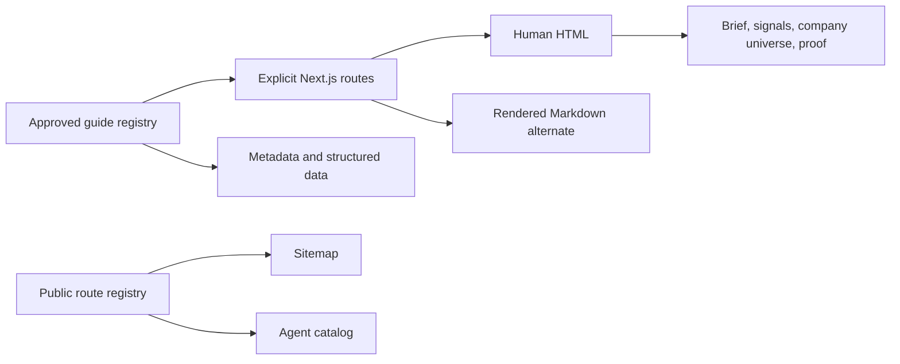

## Context

High Signal's public application already has a coherent evidence-led interface:
dark zinc background, one cyan accent, Geist Sans and Mono, square one-pixel
boundaries, generous page spacing, and no decorative motion. The existing
`PageShell`, headings, panels, lists, metadata helpers, public route registry,
and agent-edge renderer are the implementation authority.

The new pages are approved editorial entry points, not a blog or CMS. Their job
is to route intent into the Daily Brief, company universe, signals, methodology,
and track-record proof surfaces.

## Goals / Non-Goals

**Goals:**

- Render the four approved drafts through one typed, data-driven guide model.
- Keep every factual claim traceable to repository evidence.
- Give each route unique metadata, canonical URL, structured data, internal
  links, sitemap membership, agent-catalog identity, and Markdown alternate.
- Preserve the existing live SEO/GEO audit while explaining what it does and
  does not measure.
- Keep the reading experience responsive, keyboard accessible, and consistent
  with the incumbent visual system.

**Non-Goals:**

- A general-purpose publishing CMS or new navigation hierarchy.
- More generated company profiles or lower corpus thresholds.
- Ranking, investment-return, customer-result, or AI-citation claims.
- API changes, provider fan-out, database work, or a new High Signal product.

## Decisions

### 1. Use a typed registry plus four explicit routes

`intelligence-guides.ts` stores the approved page copy, metadata, sections,
links, proof statements, and FAQ items. One reusable component renders the
reading pattern. Four explicit `page.tsx` files select a guide by constant key,
which preserves obvious route ownership and avoids a root catch-all.

Alternative considered: duplicate five long pages. Rejected because metadata,
schema, hierarchy, and internal-link behavior would drift.

### 2. Treat the pages as entry points, not destinations in isolation

Every section links directly to an existing product or proof route. The homepage
and Explore directory gain a small, contextual path into the new cluster; the
primary navigation labels remain unchanged.

### 3. Extend the existing agent-rendering boundary

Static route registration makes the new pages available to the canonical
sitemap, `/api/ai`, content-negotiated Markdown, and `.md` suffix routes through
the existing shared boundary. The agent index and full brief name the new entry
points explicitly.

### 4. Explain readiness separately from awareness

`/agent-eval/seo` keeps its live URL audit and adds approved explanatory sections
below the result. Technical crawlability does not become a claim that a provider
mentions or cites the brand. A missing observation is never rendered as zero.

### 5. Preserve the evidence-terminal visual system

The reusable reading surface uses the current `PageShell`, one-pixel rules,
restrained cyan emphasis, square controls, and wide-to-narrow responsive layout.
No cards, gradients, shadows, new motion system, or alternate navigation is
introduced.

## Data and rendering flow

## Risks / Trade-offs

- [Risk] Intent pages repeat product facts already present elsewhere. → Mitigation:
  keep facts in the typed registry, link to canonical proof, and test source
  claims rather than creating new data stores.
- [Risk] Several pages could cannibalize one another. → Mitigation: each route
  owns a distinct category, audience, or workflow intent and links across the
  cluster only where it helps the reader.
- [Risk] Editorial copy can drift from product direction. → Mitigation: preserve
  the approved manifest copy and add targeted assertions for critical claims.
- [Risk] Static route additions could drift across discovery surfaces. →
  Mitigation: retain the shared public-route registry and existing parity tests.

## Migration Plan

1. Add the typed guide registry and reusable renderer.
2. Add four explicit routes and extend the existing audit surface.
3. Register discovery and internal-link paths.
4. Run targeted corpus, SEO, type, build, docs, and browser checks.
5. Complete preserve-lane design evidence and owner review.
6. Commit, open the issue-linked PR, and keep deploy as a separately gated step.

Rollback removes the four routes and audit explainer, restores the prior agent
index text, and leaves the qualified dynamic corpus untouched.
