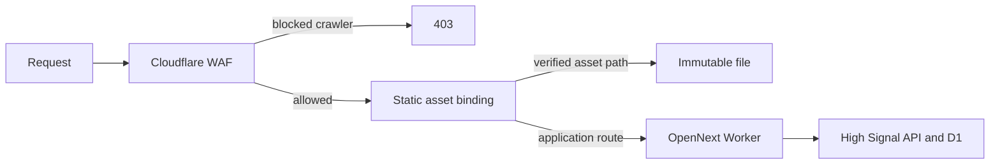

## Context

Cloudflare analytics for the current billing cycle showed a concentrated
`high-signal-web` CPU spike driven by repeated Meta ExternalAgent requests.
Cloudflare now blocks that user agent before Worker execution. The application
still sends every path except `/` and `/docs/*` through the OpenNext Worker
first, including immutable files already present in `.open-next/assets`.

The baseline Cloudflare build classifies `/about`, `/changelog`, `/explore`,
`/methodology`, `/privacy`, and `/terms` as static. It classifies `/history` as
dynamic solely because the page declares `force-dynamic`; the component itself
contains no request, authentication, API, time, or personalization input.

## Goals / Non-Goals

**Goals:**

- Stop immutable Next.js and Astro assets from invoking the Worker first.
- Prerender the request-independent `/history` page.
- Preserve the current dynamic behavior of authenticated, personalized, API,
  random, and request-dependent routes.
- Make the routing boundary testable from tracked configuration and source.

**Non-Goals:**

- A global HTML cache rule or cache-everything policy.
- Caching authenticated or personalized responses.
- Changing the Worker CPU limit.
- Changing API, D1, or ingestion behavior.
- Deploying the application as part of local implementation.

## Decisions

### Use explicit static-asset exclusions

`assets.run_worker_first` remains the default for application routes. Only
paths proven to exist in the generated asset directory are excluded:
`/_next/static/*`, `/_astro/*`, the existing docs overlay, and immutable
top-level discovery/icon assets.

This is preferred over switching the whole site to asset-first because OpenNext
does not copy every prerendered Next.js HTML route into `.open-next/assets`.
An overly broad exclusion could therefore return an asset 404 instead of
falling through to the Worker.

### Make `/history` static at the source

Replace `force-dynamic` with `force-static`. The route is a fixed placeholder
and does not read live history. This lets Next.js and OpenNext prerender and
reuse the response without altering its content.

### Keep dynamic routes explicit

No authentication, operator, API proxy, random-selection, or personalized page
is moved behind shared caching. This avoids cross-user data exposure and stale
write/read behavior.

### Validate configuration rather than generated artifacts in unit tests

A focused test reads `wrangler.toml` and the `/history` page source. The
Cloudflare build remains the integration proof that `/history` is static and
that the declared asset directories exist.

## Risks / Trade-offs

- **An excluded asset path is missing** → Limit exclusions to paths observed in
  the current `.open-next/assets` output and verify with `cf:build`.
- **A future route needs request-time behavior** → The source-level test makes
  `/history`'s static contract explicit; changing that behavior requires
  updating the contract deliberately.
- **CPU remains elevated on dynamic pages** → The specific runaway crawler is
  already blocked. Reassess live CPU after one weekly Spend Guard sample before
  expanding caching to data-driven pages.
- **Static content becomes stale** → Only deployment-versioned files and a
  fixed placeholder page are included; no live data response is cached here.

## Migration Plan

1. Land and validate the config, page declaration, and focused test locally.
2. Run the full Cloudflare build and confirm `/history` is reported static.
3. Review the generated asset directory against every bypass pattern.
4. Deploy manually using the existing SHA-tagged command when separately
   approved.
5. Verify immutable assets return normally, `/history` remains correct, and
   authenticated routes still reach the Worker.

Rollback is a normal source revert followed by a manual SHA-tagged deploy. The
already-live WAF crawler block is independent and does not need to be removed
to roll back application routing.

## Open Questions

None for this bounded change. Data-driven public page caching remains evidence
gated on the next usage sample.
