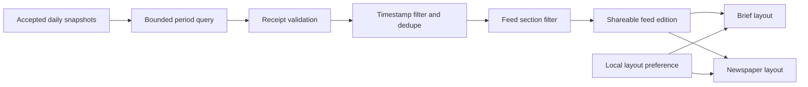

## Context

The current root route server-renders one `BriefSnapshot` with three public arrays (`stocks`, `ideas`, `trends`) and an immutable daily archive stored in D1 by `(date, region)`. Items already carry their own publish/surface timestamps and evidence links. See `proposal.md` for the product motivation and the capability specs for observable behavior.

The visual lane is **preserve**: extend the existing Evidence Terminal system with a compact editorial control strip and a second composition mode. This is not a replacement brand direction. The Daily Diff is a structural reference for edition identity and browsable density, not a source for styling, assets, or code.

## Goals / Non-Goals

**Goals:**

- Reuse accepted daily snapshots as the only public editorial source of truth.
- Make feed, cadence, and layout visibly independent concepts.
- Keep feed routes shareable while keeping the layout preference local and cache-safe.
- Deliver an editorial Newspaper mode without weakening evidence visibility or mobile reading.

**Non-Goals:**

- New source adapters, AI-written period summaries, personalization, subscriptions, or recommendation ranking.
- A standalone product for each feed or changes to the Daily Brief publication gate.
- New storage tables or scheduled weekly/monthly snapshot jobs in the first version.
- Connected-brand Mentions or Agent Eval feeds in the public switcher.
- Source-count, latency, language, or licensed-data equivalence with enterprise platforms.

## Decisions

### 1. Use a shared, typed feed registry

The registry will define slug, label, description, included public sections, supported cadences, default cadence, and explanation for slower cadences. Both the Worker and web app will consume the same registry from `@high-signal/shared` so unsupported combinations, labels, and routes cannot drift.

Initial matrix:

| Feed | Included content | Cadences | Default |
| --- | --- | --- | --- |
| The Brief | Markets, opportunities, behavior | Daily, weekly, monthly | Daily |
| Markets & Companies | Markets only | Daily, weekly, monthly | Daily |
| Opportunity Radar | Opportunities only | Weekly, monthly | Weekly |
| Behavior & Culture | Behavior only | Weekly, monthly | Weekly |

Alternative considered: expose every source or existing lens as a feed. Rejected because source directories and operator lenses are not edited publications, and the resulting switcher would recreate the navigation problem this change is meant to solve.

### 2. Use UTC calendar periods and immutable daily provenance

Daily uses one `YYYY-MM-DD` snapshot, weekly uses the ISO Monday-through-Sunday week containing the requested date, and monthly uses the UTC calendar month. Current incomplete periods are labeled in progress. Historical daily source records remain `/brief/<date>`; rollups contain source-edition dates rather than copying or rewriting snapshots.

Alternative considered: rolling 7- and 30-day windows. Rejected because their boundaries change daily, making edition identity and archive links harder to reason about.

### 3. Add one bounded rollup endpoint with no migration

The Worker will accept validated `feed`, `cadence`, `period`, and `region` inputs, fetch only snapshots inside the resolved date bounds, parse them defensively, discard snapshots that fail the current edition receipt, filter items by their own timestamps, and de-duplicate them. It returns edition metadata plus a filtered `BriefSnapshot`-compatible payload and provenance dates.

Daily current root behavior stays on the existing fast path. The new endpoint is used by focused and period feed routes. Query range is capped to one calendar month and known regions/feed values, preventing an unbounded D1 scan or cache-key explosion.

Alternative considered: fetch every contributing date from Next.js and merge in the web Worker. Rejected because it multiplies network calls and repeatedly parses the same D1 rows.

### 4. De-duplicate by existing stable identity

Markets use `signalSlug`. Opportunities and behavior use a normalized first evidence URL when present, falling back to normalized `(title, surfacedAt-date)`. The most recent accepted representation wins; contributing snapshot dates are retained. Items whose own `publishedAt` or `surfacedAt` lies outside the resolved period are excluded.

This avoids treating the same 28-day-lookback item as a new weekly occurrence. It does not infer trend strength from repeat appearances, because repeated inclusion is not independent evidence.

### 5. Use path routes for content and local state for presentation

Focused editions use `/feeds/<feed>/<cadence>` for the current period and `/feeds/<feed>/<cadence>/<period>` for stable archives. Period keys are `YYYY-MM-DD`, `YYYY-Www`, and `YYYY-MM`. The root remains the current daily Brief, and `/brief/<date>` remains its daily archive.

`Brief` versus `Newspaper` is stored as a small local preference and applied through an edition-root data attribute. A pre-paint inline initializer may apply a valid stored value; failure leaves Brief active. The server never reads the preference, so public HTML and API payload caching remain shared.

Alternative considered: a `?view=` URL parameter or cookie. Rejected because the view is not different content and should not fragment canonical URLs or public cache entries.

### 6. Preserve semantic order across both layouts

Brief mode remains the current linear section flow. Newspaper mode uses the same DOM sequence and item order, with CSS grid to create a lead-plus-columns editorial composition at wide widths. On mobile and reduced space it collapses to the existing single-column order. The control is an accessible two-option group with an explicit selected state.

### 7. Treat parity as a tested capability manifest, not a marketing claim

A small typed manifest will record reference product, official reference URL, benchmark data capability, High Signal source IDs or owning product capability, status (`covered`, `partial`, `unavailable`), and a plain-language limitation. A focused test reads the generated `apps/web/src/lib/source-catalog.json` and fails if a source-backed capability marked covered loses all mapped source IDs.

The initial reference set is deliberately limited to products already used in High Signal decisions:

| Reference | Capability compared | High Signal boundary |
| --- | --- | --- |
| The Daily Diff | HN, GitHub, papers; delayed editorial edition | Covered through HN, GitHub, Semantic Scholar; different editorial gate |
| Octolens | Developer/community/news platform coverage | Covered for Reddit, GitHub, HN, YouTube, Bluesky, Stack Overflow, DEV, podcasts, newsletters, Product Hunt, and news; partial without dependable X, LinkedIn, TikTok, or Medium parity |
| Peekaboo | Multi-model answer and citation-source tracking | Covered by Mentions/OpenLens where provider credentials are configured; Google AI Mode remains partial |
| Subreddit Signals | Posts/comments, buyer intent, pain/competitor context, reply drafting | Covered by Reddit/community research and intent-opportunity workflows; delivery latency and managed-service claims are not compared |
| AlphaSense / Quartr | Company filings, IR, news/regulatory, financial context | Public-data capability covered; premium research, expert calls, real-time global transcripts, audio, and slides remain partial/unavailable |
| RavenPack | News/social signals, entity links, knowledge graph | Public capability shape covered; source volume, languages, proprietary models, and latency are not parity claims |

Each edition coverage receipt is computed from the evidence URLs that survive rollup filtering, using the existing source classifier. It returns configured classes, contributing classes, unique domains, and feed-relevant material gaps. The UI shows a compact summary and links to a durable parity methodology page; it does not turn competitor names into decorative marketing copy.

## Data Flow

## Risks / Trade-offs

- **Sparse weekly or monthly feeds** → Render explicit empty states; do not widen the time window or relax evidence gates.
- **Legacy snapshots fail the current receipt** → Exclude them from new rollups while preserving their original immutable daily URLs.
- **Current period changes before close** → Label it `in progress`; stable period URLs remain deterministic for the accepted snapshots available at request time and become complete after the period ends.
- **Newspaper mode causes layout shift** → Apply the stored data attribute before hydration when possible and keep both modes structurally compatible.
- **Monthly query and JSON parsing increase Worker CPU** → Bound to one month, select only `date`, `region`, and `brief_json`, rely on the composite primary key range, and cache anonymous successful responses using the existing public cache contract.
- **Feed controls become another navigation bar** → Keep the publication strip inside the edition, limit it to four feeds, and leave global site navigation unchanged.
- **Parity manifest drifts from live adapters** → Test covered source mappings against the generated source catalog and give every non-source capability an owning feature-test reference.
- **Competitor claims age** → Store official URLs and a verification date, scope statements to data capabilities, and re-verify before changing status.

## Migration Plan

1. Land shared contracts, pure period/dedupe helpers, and unit tests.
2. Land the parity manifest, source-catalog regression test, and durable methodology page.
3. Add the read-only Worker endpoint, edition coverage receipt, and focused API tests; no database migration.
4. Add feed routes and the preserve-lane UI controls, then verify responsive/accessibility behavior.
5. Keep `/`, `/brief`, and `/brief/<date>` unchanged during rollout; rollback removes the new feed routes and control without touching snapshots.
