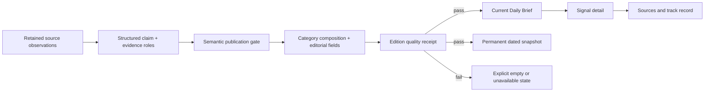

## Context

See `proposal.md` for motivation. The current root route is a signals-and-methodology landing page while `/brief` contains the product's primary artifact. Primary navigation is organized around internal systems (`data`, `signals`, `history`, `evals`), and the brief hero repeats that system loop while also exposing region and seed-product controls. The API independently falls back to synthetic public content for empty stocks, ideas, and trends and adds rotating seed-product sections for anonymous readers.

High Signal already has the main primitives needed for a cleaner edition: permanent `daily_brief_snapshots`, structured claim evidence roles (`primary`, `corroboration`, `contradiction`, `context`), detailed signal markdown, region-scoped composition, source documents, and dedicated Signals, Sources, Track record, Mentions, and Agent Eval routes. Existing dated snapshots are append-only historical records and must not be rewritten.

The visual work is a preserve-lane refinement of `DESIGN.md`: the Evidence Terminal remains dark, flat, typographic, and restrained. This change reorganizes hierarchy and reading flow; it does not introduce a newspaper skin or copy TDD's visual identity.

## Goals / Non-Goals

**Goals:**

- Make today's edition, its three broad categories, and its next verification actions immediately legible.
- Use one enforceable content path from structured source evidence through claims, brief items, and the archive gate.
- Let strong-coverage days produce longer editions without weakening the publication threshold.
- Preserve backward compatibility for existing dated snapshots, API consumers, and authenticated delivery while simplifying the public web experience.

**Non-Goals:**

- Reducing High Signal to computer-science news or a single source family.
- Replacing the signal detail, source directory, track-record ledger, Mentions, or Agent Eval products.
- Rewriting published signal markdown or historical brief snapshots.
- Adding a CMS, manual editorial queue, production dependency, database migration, or new source ingress.
- Deploying, migrating, committing, or pushing as part of implementation.

## Decisions

### 1. Make `/` canonical for the current edition and keep dated briefs under `/brief/<date>`

The root route becomes the current Daily Brief. `/brief` permanently redirects to `/`, while `/brief/archive` and `/brief/<date>` remain unchanged. Primary navigation becomes Brief, Signals, Track record, and Sources; Explore retains access to the larger route inventory and dedicated tools.

This creates one obvious entry point without renaming the durable archive family. The current marketing and methodology copy moves behind existing About, Methodology, and intelligence-guide routes rather than competing with the edition.

Alternative considered: keep the marketing homepage and add a larger “Read today’s brief” button. Rejected because it preserves two candidate starting points and contradicts the product direction that the brief is the product.

### 2. Treat the page as one editorial ledger, not a dashboard of product modules

The first viewport contains edition identity, a concise editorial promise, freshness/region controls, and a contents row for the three categories. Category entries use stable anchors and counts. Sections become continuous ruled lists with square boundaries and measured prose rather than separate rounded panels. Convergence moves inside the market category as a subordinate “developing” strip. Sharing and archive navigation remain available but do not interrupt the path to the first item.

On narrow screens the contents row becomes a horizontally scrollable, keyboard-accessible anchor list; items remain a single reading column. On wider screens evidence and hit-rate metadata can occupy a restrained secondary column, while editorial prose remains the focal column.

Alternative considered: tabs that show one category at a time. Rejected because tabs hide the breadth the user explicitly wants the edition to communicate and complicate permanent links and printed/agent-readable output.

### 3. Add structured editorial fields to the brief contract without a database migration

`BriefStockItem` gains backward-compatible optional fields for `whatChanged`, `whyItMatters`, and `uncertainty`. New signal generation and claim publication require those statements to be grounded in the signal body and evidence. The brief composer reads explicit structured sections when present and may deterministically extract complete sentences from eligible historical bodies; it never asks the renderer to truncate raw markdown or invent missing copy.

Idea and trend items retain their existing descriptions and gain a concise `whyNow`/reader-value field when grounded. New snapshots require the relevant editorial fields; historical snapshots continue rendering their legacy `headline` contract with a visible legacy treatment.

Alternative considered: generate summaries at page render time. Rejected because output would drift between requests, create latency/cost, and make dated editions non-deterministic.

### 4. Replace fallback arrays with explicit category composition states

Each public category builder returns both items and a state: `ready`, `empty`, or `unavailable`, plus a non-sensitive reason code. Empty results and caught errors no longer call `fallbackStocks`, `fallbackIdeas`, or `fallbackTrends`. Seed utilities remain available to tests and explicitly labeled demos, but no public composition path imports them.

The public web brief ignores personalized `perception` and `improvements` fields even when an authenticated API response contains them. The product picker and rotating spotlight are removed from the public hero. This preserves API and delivery compatibility while making the web edition consistently public and non-personalized.

Alternative considered: add a “demo data” badge to the existing fallback. Rejected because plausible synthetic claims still weaken the archive and evidence promise even when labeled.

### 5. Use existing evidence roles as the semantic gate

The existing claim-evidence role model becomes authoritative. A claim is eligible only when it has a primary and independent corroborating link attached to the same assertion, no unresolved contradiction, and a usable source receipt. `context` links remain visible on the signal detail but contribute no supporting count.

The deterministic gate verifies role counts, independence, URL structure, retained source-document/fetch evidence, and explicit alignment status recorded during claim creation or AI judging. It does not infer relevance from domain count, entity tokens, or body length. The existing free/local AI path can classify ambiguous alignment during draft judging; HOLD still fails closed when no judge is available.

The brief renderer shows only the primary and strongest corroboration by default. Supplemental context remains on the signal page, preventing unrelated entity-adjacent sources from dominating the edition card.

Alternative considered: perform live HEAD requests for every citation during each page render. Rejected because provider blocking and transient network errors would make editions unstable; validation belongs at ingest/publish and pre-snapshot time using retained receipts.

### 6. Separate the quality threshold from the operational safety bound

Composition first filters by editorial and evidence eligibility, then ranks by reader value, freshness, novelty, and confidence, and finally applies a high safety bound per category. There is no minimum count and no score relaxation. The bound prevents runaway payloads but is not presented as the desired edition size.

This preserves broad coverage: a strong day can exceed today's normal volume, while a weak day produces a short edition. Category counts in the contents row make that variation explicit.

Alternative considered: a fixed total of 6–10 items. Rejected because the user wants the edition to benefit from High Signal's wider coverage when quality supports it.

### 7. Gate snapshot writes with a pure edition receipt

Before `precomputeBriefSnapshots` writes a date/region snapshot, a pure validator produces an edition receipt with category states and counts, supporting-evidence counts, malformed-field/link failures, legacy/synthetic markers, and the gate result. An invalid run logs the receipt and leaves any existing snapshot for that date/region unchanged. A valid partial edition may archive when at least one category is ready and other categories are explicitly empty; unavailable infrastructure states fail the snapshot.

The gate runs before the existing D1 upsert and does not create a second archive. Existing archived records are never revalidated or rewritten.

Alternative considered: archive every composition and show warnings later. Rejected because a permanent archive should record accepted editorial output, not transient pipeline failure.

## Data and reading flow

## Risks / Trade-offs

- [Risk] Removing fallback content exposes empty community or opportunity categories. → Mitigation: explicit category states, source-health diagnostics, and no change to dedicated collection work.
- [Risk] Requiring structured editorial fields temporarily reduces eligible market items. → Mitigation: deterministic extraction for complete historical prose and a forward generator contract; never weaken the evidence gate.
- [Risk] Redirecting `/brief` changes a heavily linked route. → Mitigation: permanent same-origin redirect, canonical tests, retained dated/archive routes, and link-registry updates in one change.
- [Risk] Existing personalized delivery still contains five-section language while the public web edition has three. → Mitigation: keep delivery backward-compatible in this change and label it as an owner digest; a later change can simplify private delivery if the owner wants personalization removed everywhere.
- [Risk] Longer strong editions can become tiring. → Mitigation: issue contents, strong lead ordering, readable measure, category anchors, and a high operational bound after quality filtering.
- [Risk] Relevant paywalled or bot-blocked sources can look unreachable to a naive link checker. → Mitigation: accept retained successful source receipts and excerpts; do not equate a render-time 403 with a dead source.

## Migration Plan

1. Add pure eligibility, category-state, editorial-field, and edition-receipt tests around existing snapshots and claim fixtures.
2. Stop public fallback and spotlight composition while retaining fixture utilities and backward-compatible response fields.
3. Add the optional editorial contract and populate it only from grounded signal content.
4. Introduce the snapshot gate in report-only mode against local fixtures, then make invalid new writes fail closed.
5. Refactor the current brief into a shared current-edition surface, switch root canonical ownership, and redirect `/brief`.
6. Simplify primary navigation and the brief layout, preserving existing ShareBar/footer work.
7. Run focused shared/API tests, web typecheck, route/canonical checks, browser review at 390/768/1440, and the design-workflow receipt checks.

Rollback restores the prior root component, navigation list, and composer selection while leaving new optional brief fields ignored. No historical snapshot or source record is deleted.
