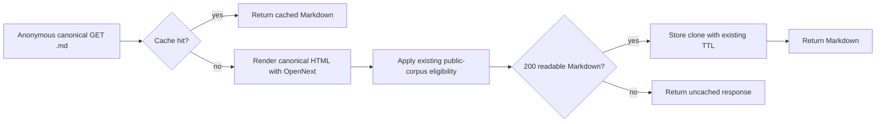

# Design: public agent Markdown cache

## Current path

`worker.mjs` resolves a public Markdown request, calls `openNext.fetch()` for
the canonical HTML page, converts the response, and returns it. This happens
before the Worker's existing HTML document cache.

## Proposed path

## Boundaries

The helper accepts the cache and `waitUntil` callback as injected capabilities,
so its behavior is testable without importing the generated OpenNext Worker.
Only `GET` requests with an explicit `.md` suffix, no query string, and no
authenticated session are eligible. The stable cache key is a clean GET for
the exact same-origin Markdown URL with no user headers.

Only status-200 responses with a Markdown content type and no `Set-Cookie`
header are stored. Error and `noindex` results keep their current behavior and
cannot poison the cache. Cache writes are asynchronous through `ctx.waitUntil`.

## Observability

Eligible responses carry `x-edge-cache: AGENT-HIT` or `AGENT-MISS`. This is
diagnostic only and does not change caching or content semantics.

## Rollback

Reverting the helper call restores request-time rendering. Cached entries
expire under the existing one-hour shared TTL; no data migration or purge is
required.
