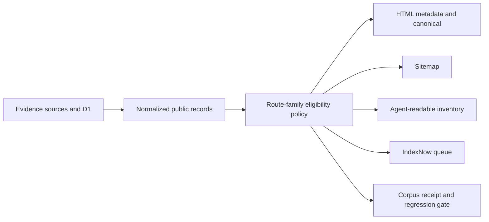

## Context

See `proposal.md` for motivation. High Signal currently has two discovery mechanisms that can drift: a static public-route registry and a dynamic sitemap that independently enumerates up to 5,000 signals, 5,000 entities, 20,000 entity-month archives, every signal type, 260 directory pages, and 12,964 company profiles. Dynamic route metadata makes its own decisions, and IndexNow keeps a separate URL state.

The full company artifact is 35 MB and retains official source evidence. The 20 MB web artifact strips every `sourceEvidence` array while keeping a count, causing profiles to show an unavailable-evidence message. The corpus already has useful enrichment: 11,959 companies have extracted facets and every company has a bounded reciprocal peer graph. A deterministic initial company threshold of official provenance, 160 or more description characters, at least two facets, and meaningful product-based similarity currently yields about 5,178 candidates before provenance is restored.

## Goals / Non-Goals

**Goals:**

- Make search discovery an explicit, testable subset of the public product corpus.
- Prefer thousands of substantive evidence pages over either one generic article or every reachable route.
- Keep one decision shared by HTML metadata, sitemaps, agent surfaces, and submission automation.
- Preserve product exploration for sparse records while preventing them from diluting the indexable corpus.

**Non-Goals:**

- Removing sparse company records from the product.
- Generating filler prose, fabricated citations, or model-written company claims.
- Adding a separate blog CMS or a batch of generic keyword articles.
- Automatically deploying the changed corpus.

## Decisions

### 1. Use a shared route-family eligibility contract

One pure policy module will return `{ eligible, tier, reasons, policyRevision }` for company, signal, entity, entity-period, brief, taxonomy, and directory-pagination inputs. Route metadata, sitemap generation, and agent-surface generation will consume this verdict rather than reimplementing thresholds. Fleet's external IndexNow runner will consume the resulting eligible sitemap rather than gaining a second High Signal policy implementation.

Alternative considered: keep independent conditions in each surface. Rejected because the current sitemap, metadata, and submission state already drift and cannot produce one auditable corpus count.

### 2. Start company discovery with a conservative deterministic threshold

An indexable company profile must have compact official provenance, at least 160 description characters, at least two extracted product facets, and at least one reciprocal similarity edge whose reason includes product, concept, capability, use-case, technology, customer, or industry overlap. Affiliation or cohort proximity alone cannot qualify a page.

The threshold is deliberately stricter than simple route existence. It produces a large initial corpus while withholding empty directory shells. The policy revision and counts make later threshold changes reviewable.

Alternative considered: index all 12,964 profiles and wait for Search Console. Rejected because almost 4,000 descriptions are under 80 characters and 949 are empty, while the current web artifact cannot render its claimed source evidence.

### 3. Retain compact provenance instead of the full evidence payload

The web artifact will preserve only the official source fields needed by the public page: source id, source URL, institution, title, and cohort or program when present. It will not duplicate the long description already stored as the canonical company description.

Alternative considered: import the full 35 MB artifact into the web application. Rejected because the extra payload is unnecessary for rendering provenance and increases build/runtime cost.

### 4. Treat route families differently

- Published non-backfill signals qualify only with cited evidence and substantive body content.
- Entity pages qualify when they have at least one eligible published signal or substantive market/relationship evidence.
- Entity-period and signal-type pages qualify from eligible child signals and must meet a minimum child count.
- Dated briefs qualify when their retained snapshot contains the required sections and citations.
- Company profiles use the deterministic artifact threshold above.
- Numbered directory pages are always `noindex,follow` and remain outside the sitemap.

This avoids a universal word-count score that would misclassify evidence-dense market and taxonomy pages.

### 5. Generate a corpus receipt before replacing discovery output

The build will compare the new eligible URL set with the last accepted receipt. A receipt includes totals per family and reason, URL additions/removals, input revision, and policy revision. Empty families and large unexpected deltas fail closed; an explicit acceptance command updates the baseline after review.

The receipt is operational evidence, not a public marketing claim.

### 6. Strengthen templates before adding new editorial routes

Company metadata will target the actual subject, for example “Company name: product, funding source, and similar companies,” rather than “company universe.” Signal and archive pages will preserve descriptive titles, citations, dates, and related links. Structured data will be emitted only for facts present in the retained record.

High Signal's existing daily briefs, signals, entities, sectors, markets, communities, company profiles, and track record form the content system. New editorial pages can be proposed later only when Search Console or corpus gaps show a distinct unanswered intent.

## Data and discovery flow

## Risks / Trade-offs

- [Risk] Withholding pages can temporarily reduce submitted URL count. → Mitigation: retain routes as `noindex,follow`, keep qualified profiles directly in the sitemap, and measure impressions by route family.
- [Risk] Thresholds encode a quality judgment that may exclude a valuable sparse company. → Mitigation: reason codes, versioned receipts, and an evidence-based override path that requires retained provenance rather than manual keyword stuffing.
- [Risk] Dynamic APIs may be unavailable while generating discovery output. → Mitigation: fail closed to the last accepted corpus instead of returning a suddenly empty sitemap.
- [Risk] Compact provenance increases the web artifact. → Mitigation: retain only bounded scalar source fields and assert artifact size in the build receipt.

## Migration Plan

1. Add the policy and fixture tests without changing public discovery.
2. Restore compact company provenance and generate a dry-run receipt.
3. Review eligible and withheld samples for every route family.
4. Wire metadata and sitemap to the shared policy; keep external IndexNow submission disabled for the new set until parity tests pass.
5. Accept one baseline receipt, then enable agent surfaces and let Fleet's IndexNow runner consume the eligible sitemap.
6. Typecheck and build locally; commit and push separately. Production deployment remains manual.

Rollback consists of restoring the prior discovery-policy revision and last accepted receipt; no product records are deleted.
